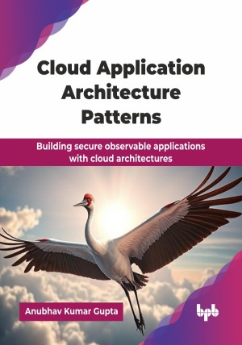

# Cloud Application Architecture Patterns

Building secure observable applications with cloud architectures.

This is the repository for [Cloud Application Architecture Patterns
](https://bpbonline.com/products/cloud-application-architecture-patterns?variant=44709978243272),published by BPB Publications.

## About the Book
Cloud computing has become the foundation of modern software delivery, powering everything from agile startups to global enterprises. As businesses race to modernize, understanding how to design cloud-native applications that scale, recover, and evolve has never been more essential. This book steps in as your go-to guide for navigating the architectural challenges of today’s dynamic cloud landscape.

This book systematically covers cloud evolution, from traditional IT to IaaS, PaaS, and SaaS, including deployment models and data concepts. You will master fundamental principles like scalability and resource pooling, then explore service models in depth with migration case studies. Chapters detail practical scalability patterns (load balancing, auto-scaling, partitioning) and resiliency patterns (health monitoring, circuit breakers). Essential data management and crucial security patterns (identity, encryption, compliance) are covered. Finally, you will learn advanced messaging and integration patterns, robust monitoring and observability patterns vital for DevOps, and explore future trends like serverless, edge, and AI integration.

By the end, you will possess comprehensive knowledge and practical understanding of cloud application design, ready to confidently architect, deploy, and manage effective, secure cloud solutions.

## What You Will Learn
• Design scalable, cloud-native applications with proven architecture patterns.

• Apply resiliency strategies like failover and graceful degradation.

• Understand deployment models and pick the right one for your needs.

• Architect secure systems with encryption and API security.

• Implement observability with metrics, traces, and logging.

• Navigate hybrid integrations using event-driven and messaging patterns.

• Stay ahead with trends like serverless and sustainable cloud designs.
